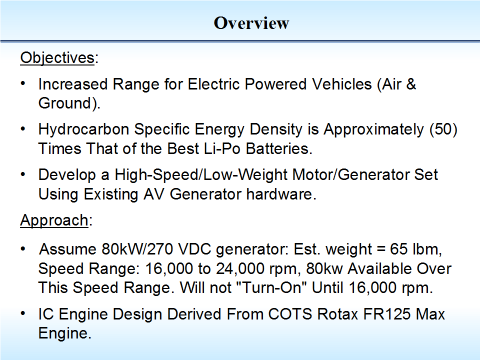
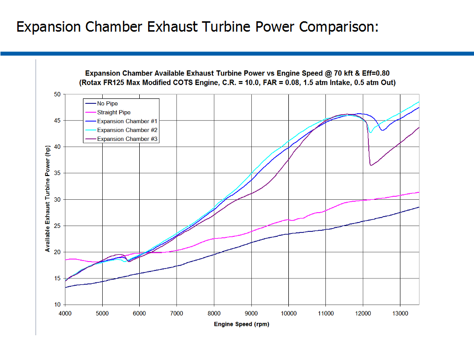
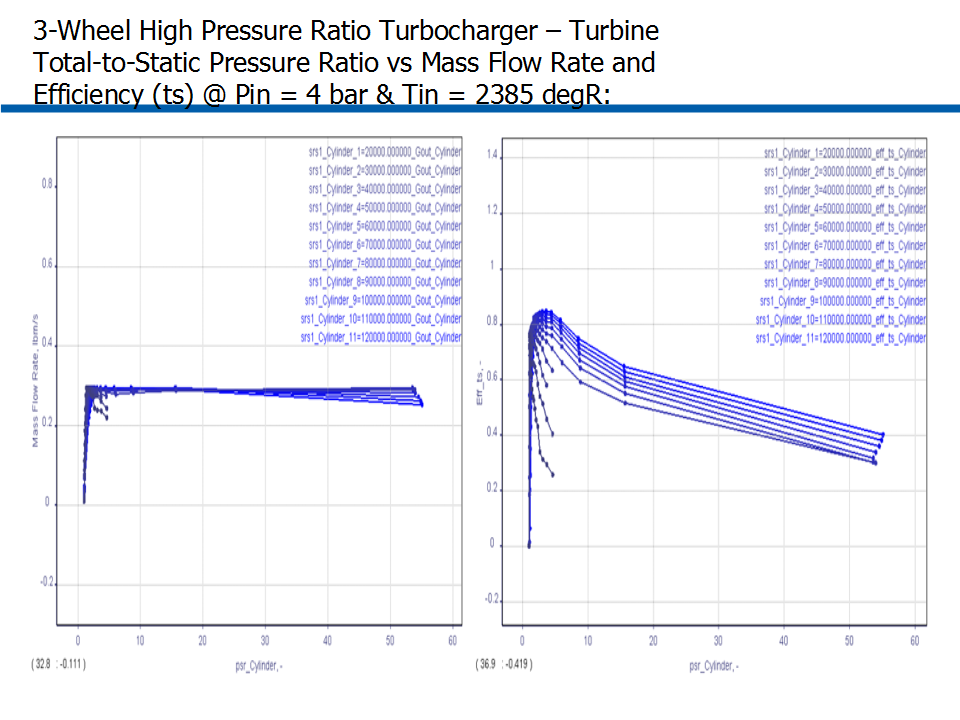

# ========================================
# High-Speed Light-Weight Motor/Generator Set Design For Increased Range of Electric Propulsion Vehicles:
# ========================================

## 
## 
## 1. Overview of Motivation and Assumptions:

## 
## 
## 2. Example of Existing High-Speed Generator:

## 
## 
## 3. Overview of High-Speed Motor/Generator Set Schematic:

## 
## 
## 4. Overview of IC Engine Design Features:

## 
## 
## 5. Overview of Modified COTS IC Engine:

## 
## 
## 6. Overview of IC Engine Sub-System Performance:

## 
## 
## 7. Overview of Choked/Adiabatic 3-Stage 2-Stroke Expansion Chamber Design:

## 
## 
## 8. Comparison of Max Cylinder Pressure vs. RPM for Different Intake Boost Levels:

## 
## 
## 9. Comparison of Exhaust-to-Intake Pressure Ratio vs. RPM for Different Intake Boost Levels:

## 
## 
## 10. Comparison of BHP vs. RPM for Different Exhaust System Designs:

## 
## 
## 11. Comparison of BSFC vs. RPM for Different Exhaust System Designs:

## 
## 
## 12. Comparison of Exhaust Outlet Total-Temperature vs. RPM for Different Exhaust System Designs:

## 
## 
## 13. Comparison of Exhaust Outlet Total-Pressure vs. RPM for Different Exhaust System Designs:

## 
## 
## 14. Comparison of Exhaust Outlet Mass-Flow-Rate vs. RPM for Different Exhaust System Designs:

## 
## 
## 15. Comparison of Exhaust Turbine Power vs. RPM for Different Exhaust System Designs:

## 
## 
## 16. 1st Stage Double-Sided Compressor Overview:

## 
## 
## 17. 2nd Stage Single-Sided Compressor Overview:

## 
## 
## 18. Turbine Overview:

## 
## 
## 19. 1st Stage Double-Sided Compressor Features & Dimensions:

## 
## 
## 20. 1st Stage Compressor - 0 kft Altitude, Corrected Mass Flow Rate vs. Total Pressure Ratio:

## 
## 
## 21. 1st Stage Compressor - 10 kft Altitude, Corrected Mass Flow Rate vs. Total Pressure Ratio:

## 
## 
## 22. 1st Stage Compressor - 30 kft Altitude, Corrected Mass Flow Rate vs. Total Pressure Ratio:

## 
## 
## 23. 1st Stage Compressor - 50 kft Altitude, Corrected Mass Flow Rate vs. Total Pressure Ratio:

## 
## 
## 24. 1st Stage Compressor - 80 kft Altitude, Corrected Mass Flow Rate vs. Total Pressure Ratio:

## 
## 
## 25. 2nd Stage Single-Sided Compressor Features & Dimensions:

## 
## 
## 26. 2nd Stage Compressor - Corrected Mass Flow Rate vs. Total Pressure Ratio:

## 
## 
## 27. Turbine Features & Dimensions:

## 
## 
## 28. Turbine Total-to-Static Pr vs. Mass Flow Rate & Efficiency @ Pin = 1 bar & Tin = 2385 degR:

## 
## 
## 29. Turbine Total-to-Static Pr vs. Mass Flow Rate & Efficiency @ Pin = 2 bar & Tin = 2385 degR:

## 
## 
## 30. Turbine Total-to-Static Pr vs. Mass Flow Rate & Efficiency @ Pin = 3 bar & Tin = 2385 degR:

## 
## 
## 31. Turbine Total-to-Static Pr vs. Mass Flow Rate & Efficiency @ Pin = 4 bar & Tin = 2385 degR:

## 
## 
## 32. Turbine Total-to-Static Pr vs. Mass Flow Rate & Efficiency @ Pin = 5 bar & Tin = 2385 degR:

## 
## *Notes: 
## 1. Turbomachinery Performance Data and Analysis performed using AxStream, SoftInWay Inc.
## 2. ICE Performance Data and Analysis performed using "GT-Suite", Gamma Technologies Inc.
